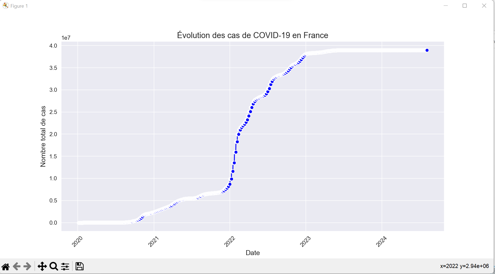

# Mon Portfolio
# Portfolio Data Science et IA
Ce repository contient des projets que j'ai réalisés dans le domaine de la Data Science et de l'IA.

## Projet 1 : Analyse des données Covid
Description du projet d'analyse des données Covid avec Python et Seaborn.
# 📊 Analyse des tendances du COVID-19  

Ce projet analyse les tendances du COVID-19 en utilisant Python et des bibliothèques comme Pandas et Matplotlib.  

## 🛠 Technologies utilisées  
- Python  
- Pandas  
- Matplotlib  
- Jupyter Notebook  

## 🚀 Comment exécuter le projet ?  
1. Clonez ce dépôt :  
   ```bash
   git clone https://github.com/aouississaesso/portfolio.git
2. Accédez au dossier du projet :
   cd portfolio
3. Installer les dépendances nécessaires :
    pip install -r requirements.txt
4. Exécutez le projet :
Si c'est un fichier Python ( .py), utilisez : 
    python fichier1.py
 Si c'est un Jupyter Notebook , ouvrez-le avec :
    jupyter notebook
## 🚀 résultats obtenus 
 


---

🔹 **Quelques précisions :**  
✔ **On a utilisé Jupyter Notebook ?** → Si ton code était dans un fichier `.ipynb`, alors oui. Sinon, il faut juste mentionner Python.  
✔ **Besoin de `requirements.txt` ?** → Si ton projet a des bibliothèques spécifiques (Pandas, Matplotlib, etc.), crée ce fichier avec la commande :  
   ```bash
   pip freeze > requirements.txt


